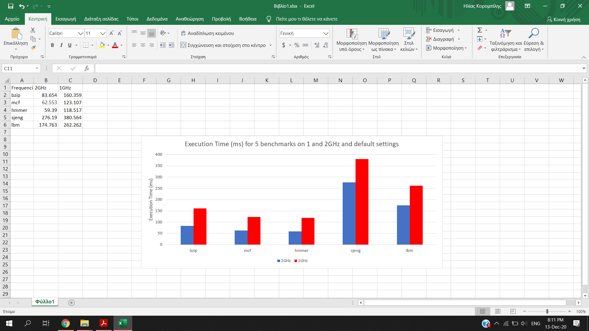

## Δεύτερο Εργαστήριο Αρχιτεκτονικής Προηγμένων Υπολογιστών

_ΟΜΑΔΑ 15_  
**Ιωάννης Τζιραλής** ΑΕΜ: 9198  
**Ηλίας Κορομπίλης** ΑΕΜ: 8993

### 1. Εκτέλεση SPEC CPU2006 Benchmarks στον gem5  
Ο επεξεργαστής που εξομοιώνει ο gem5 έχει τις βασικές παραμέτρους:
* L1 instruction cache size = 32kB
* L1 instruction cache associativity = 2
* L1 data cache size = 64kB
* L1 data cache associativity = 2
* L2 cache size = 2MB
* L2 cache associativity = 8
* Cache line size = 64B  

Τα αποτελέσματα των benchmark:  
|       | Χρόνος Εκτέλεσης (sim_seconds) | CPI (Cycles Per Instruction | L1 icache miss rate | L1 dcache miss rate  | L2 miss rate |
|:-----:|:------------------------------:|:---------------------------:|:-------------------:|:--------------------:|:------------:|
| bzip2 |            0.083654            |           7.768166          |       0.002785      |       0.153317       |   0.999093   |
|  mcf  |            0.062553            |           1.231067          |       0.019023      |       0.002062       |   0.067668   |
| hmmer |            0.059390            |           8.182567          |       0.095271      |       0.061216       |   0.952866   |
| sjeng |            0.276190            |          10.276166          |       0.000020      |       0.121831       |   0.999978   |
|  lbm  |            0.174763            |           3.495270          |       0.000095      |       0.0609672      |   0.999940   |

