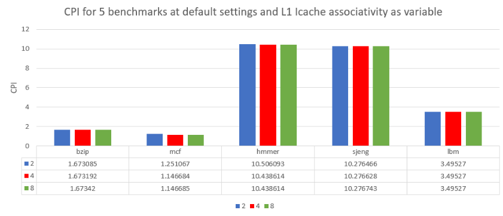

## Δεύτερο Εργαστήριο Αρχιτεκτονικής Προηγμένων Υπολογιστών

_ΟΜΑΔΑ 15_  
**Ιωάννης Τζιραλής** ΑΕΜ: 9198  
**Ηλίας Κορομπίλης** ΑΕΜ: 8993

### 1. Εκτέλεση SPEC CPU2006 Benchmarks στον gem5  
Ο επεξεργαστής που εξομοιώνει ο gem5 έχει τις βασικές παραμέτρους:
* L1 instruction cache size = 32kB
* L1 instruction cache associativity = 2
* L1 data cache size = 64kB
* L1 data cache associativity = 2
* L2 cache size = 2MB
* L2 cache associativity = 8
* Cache line size = 64B  

Τα αποτελέσματα των benchmark:  
|       | Χρόνος Εκτέλεσης (sim_seconds) | CPI (Cycles Per Instruction | L1 icache miss rate | L1 dcache miss rate  | L2 miss rate |
|:-----:|:------------------------------:|:---------------------------:|:-------------------:|:--------------------:|:------------:|
| bzip2 |            0.083654            |           7.768166          |       0.002785      |       0.153317       |   0.999093   |
|  mcf  |            0.062553            |           1.231067          |       0.019023      |       0.002062       |   0.067668   |
| hmmer |            0.059390            |           8.182567          |       0.095271      |       0.061216       |   0.952866   |
| sjeng |            0.276190            |          10.276166          |       0.000020      |       0.121831       |   0.999978   |
|  lbm  |            0.174763            |           3.495270          |       0.000095      |       0.0609672      |   0.999940   |

Αλλάξαμε τη συχνότητα λειτουργίας στα 1GHz:  
  

### 2. Βελτιστοποίση Απόδοσης  
Αλλάξαμε τις τιμές των παρακάτω παραμέτρων και εμφανίζουμε γραφήματα για να παρατηρήσουμε τις αλλαγές στην απόδοση του συστήματος (CPI). Οι παράμετροι που δεν αλλάζουν παίρνουν τις default τιμές τους.

#### L1 icache size:  

Παρατηρούμε μια μικρή αλλαγή στην απόδοση του mcf benchmark ενώ το CPI στα υπόλοιπα μένει σχεδόν σταθερό.

#### L1 icache associativity:
  
Πάλι δεν παρατηρούμε μεγάλες αλλαγές εκτός από την περίπτωση του mcf benchmark.  

#### L1 dcache size:
  

#### L1 dcache associativity:
  

#### L2 cache size:
  

#### L2 cache associativity:  
  

#### Cache line size:  
  

### 3. Κόστος απόδοσης και βελτιστοποίησης κόστους/απόδοσης  
* Η L1 έχει σημαντικά υψηλότερο κόστος ανα kB. Για αυτό και στις σύγχρονες υλοποιήσεις CPU βλέπουμε τόσο διαφορετικές τάξεις μεγέθους στην L1(κάποια kB) και L2 cache size(κάποια MB).  
Θεωρούμε λοιπόν αυθαίρετα ότι μια L1 cache κάποια δεκαδες kB κοστίζει περίπου όσο μια L2 cache κάποια MB.  
π.χ. Για 64kb L1 το κόστος είναι 1 μονάδα όσο κοστίζει και μια 2MB L2. Όσον αφορά την αλλαγή του μεγέθους , είτε στην L1 είτε στην L2 ,διπλασιασμός του μεγέθους σημαίνει διπλασιασμό του hardware που χρησιμοποιείται άρα και περίπου διπλασιασμό του κόστους, δηλαδή έχω μία σχεδόν γραμμική σχέση μεγέθους-κόστους.  
Οπότε θέτουμε:
>Κόστος L1 = size/64kb

και:
>Κόστος L2 = size/2MB

* Όσον αφορά το associativity , κάθε διπλασιασμός του associativity αυξάνει την πολυπλοκότητα και το μέγεθος των ηλεκτρονικών κυκλωμάτων που πρέπει να χρησιμοποιηθούν άρα αυξάνει αρκετά ,αλλά δε διπλασιάζει ,το συνολικό κόστος. Σύμφωνα με τη βιβλιογραφία που συμβουλευτήκαμε το κόστος του διαπλασιασμού του associativity είναι περίπου 1.5 φορές πιο κοστοβόρο.
Οπότε θέτουμε:
>Κόστος assoc = 1.5 ^ (log2 (assoc/2) )  

* Τέλος όσον αφορά το cache-line size ο διπλασιασμός του για ίδιο συνολικά μεγεθος cache θα έχει ως αποτέλεσμα διπλασιασμό του μεγέθους του buffer, άρα κάποια μικρή αύξηση κόστους , αλλά ταυτόχρονα μειώνει το μέγεθος του κομματιού tag κατά ένα bit άρα επιτρέπει την απλοποίηση και μείωση μεγέθους των κυκλωμάτων που χειρίζονται και αποθηκεύουν το κομμάτι αυτό ,άρα μειώνει και το κόστος αυτό.  
Συνολικά δηλαδή η αλλαγή του μεγέθους γραμμής cache δεν επηρεάζει σημαντικά το κόστος της υλοποίησης.  

Από τα παραπάνω προκύπτει η εξής **προσεγγιστική συνάρτηση κόστους-απόδοσης**:  
>CosPer = [ log2(L1dassoc)*(L1d size/64kB) + log2(L1iassoc2)*(L1i size/64kB) + log2(L2assoc)*(L2 size/2MB) ] / CPI

Χρησιμοποιώντας αυτή τη συνάρτηση προκύπτουν οι βέλτιστες προδιαγραφές κόστους-απόδοσης για κάθε benchmark:  

#### bzip2
* L1 icache size: 32 kB
* L1 icache assoc: 2-way
* L1 dcache size: 32 kB
* L1 dcache assoc: 2-way
* L2 cache size: 1 Mb
* L2 cache assoc: 8-way
* Cache line size: 128 Kb  

#### mcf
* L1 icache size: 32 kB
* L1 icache assoc: 4-way
* L1 dcache size: 32 kB
* L1 dcache assoc: 2-way
* L2 cache size: 1 Mb
* L2 cache assoc: 8-way
* Cache line size: 64 Kb  

#### hmmer
* L1 icache size: 32 kB
* L1 icache assoc: 2-way
* L1 dcache size: 32 kB
* L1 dcache assoc: 2-way
* L2 cache size: 1 Mb
* L2 cache assoc: 8-way
* Cache line size: 128 Kb  

#### sjeng
* L1 icache size: 32 kB
* L1 icache assoc: 2-way
* L1 dcache size: 32 kB
* L1 dcache assoc: 2-way
* L2 cache size: 1 Mb
* L2 cache assoc: 8-way
* Cache line size: 128 Kb  

#### lbim
* L1 icache size: 32 kB
* L1 icache assoc: 2-way
* L1 dcache size: 32 kB
* L1 dcache assoc: 2-way
* L2 cache size: 1 Mb
* L2 cache assoc: 8-way
* Cache line size: 128 Kb
